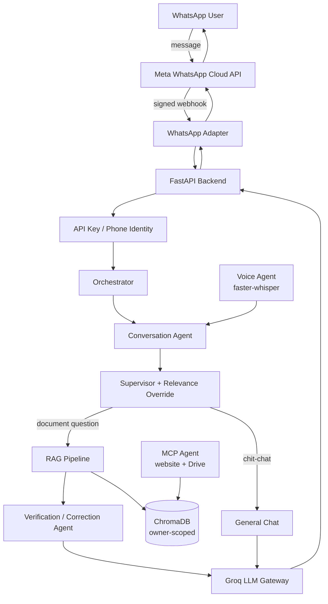

# WhatsApp GenAI Extension — Secure Multi-Agent RAG for Document & Data Retrieval

A secure, multi-agent GenAI backend that lets a business's WhatsApp
number answer questions about documents it has been authorized to
read — resumes, registration records, contracts — grounded strictly
in retrieved content, with conversation-aware follow-ups, voice
input, and website/Drive ingestion. Built end-to-end on **free-tier
infrastructure** (Groq for LLM inference, local embeddings, local
speech-to-text) so it runs at zero recurring cost.

This is **not** a WhatsApp clone and doesn't modify the official app —
it's an independent backend that connects through Meta's official
WhatsApp Business Platform (Cloud API + webhooks).

## Why this exists

Two people can't currently ask an AI to read along in a private
WhatsApp chat and answer questions about a shared document without
copying it out to a separate AI tool first. This project explores
what a secure, authorization-scoped version of that looks like for a
business's own document assistant — e.g., a records office where
clients message the business's number to ask about files already on
file for them — built with real access control, not just an LLM
wrapper.

## Architecture



## Key features

- **RAG grounded to the point of paranoia** — answers are restricted
  to retrieved chunks, checked by an independent Verification Agent,
  and *corrected* (not just flagged) when unsupported claims slip
  through
- **Conversation-aware** — resolves "his ownership %?" into a
  self-contained query using recent chat history
- **Multi-agent orchestration** — Conversation, Supervisor, RAG,
  Verification, Voice, and MCP agents, each with one job
- **Real authorization** — `owner_id` comes from a server-issued API
  key or a verified WhatsApp phone number, never a client-supplied
  field; every retrieval is scoped to it
- **MCP integration** — ingest a public URL (SSRF-protected) or an
  authorized Google Drive file straight into the same RAG index as
  uploaded documents
- **Voice in, voice-grounded out** — local Whisper transcription, no
  speech-to-text API cost
- **Security hardening** — rate limiting, audit logging, encrypted
  OAuth token storage, prompt-injection-resistant system prompts,
  webhook HMAC verification
- **36 automated tests** covering auth, SSRF protection, encryption,
  RAG routing, and webhook security

## Tech stack

| Layer | Choice | Why |
|---|---|---|
| Backend | FastAPI | async, typed, auto-docs |
| LLM | Groq (Llama/OSS models) | free tier, no `ANTHROPIC_API_KEY` cost |
| Embeddings | sentence-transformers (local) | free, no embedding API cost |
| Vector store | ChromaDB (embedded) | free, no server/Docker needed |
| Speech-to-text | faster-whisper (local) | free, no STT API cost |
| Auth | API-key / WhatsApp phone identity | real authorization, not client-trusted |
| Testing | pytest | 36 tests, offline-runnable |
| Deployment | Docker + Render (free tier) | zero-cost hosting path |

## Quick start

```bash
python -m venv venv && source venv/bin/activate   # Windows: venv\Scripts\activate
pip install -r requirements.txt
cp .env.example .env   # add your free Groq key from console.groq.com/keys
uvicorn app.main:app --reload
```

Open http://127.0.0.1:8000/demo for the prototype chat UI, or
http://127.0.0.1:8000/docs for the API reference.

Run the test suite:

```bash
pytest tests/ -v
```

## Project status

All 6 build phases are complete and tested locally (backend, RAG,
conversation/multi-agent system, MCP, voice, security hardening, and
the WhatsApp Cloud API adapter). Real end-to-end WhatsApp message
testing requires a verified Meta Business App and phone number,
which is an external account-verification step, not a code
limitation — the adapter is built and unit-tested (signature
verification, payload parsing, webhook handshake) and ready to
connect once that's in place.

## Documentation

- **[docs/BUILD_LOG.md](docs/BUILD_LOG.md)** — full phase-by-phase
  build history: what was built and why, how each phase was tested,
  and two real bugs found through user testing with complete
  root-cause writeups (a hallucination-correction gap, and a
  Supervisor misrouting bug that bypassed RAG entirely)
- **[.env.example](.env.example)** — every configuration option,
  documented inline

## Important: WhatsApp policy note

Meta restricts general-purpose AI assistants on the WhatsApp Business
Platform (see docs/BUILD_LOG.md Phase 6 for sourced details) — this
project is scoped as a business's own document assistant for its
clients, which fits Meta's sanctioned use case, rather than a general
personal AI companion.

## Alternative: Twilio WhatsApp Sandbox

Meta's own developer account registration has intermittent platform
bugs (a device-verification block, and separately an infinite loop in
the "About you" / "Contact info" registration steps — both
independently confirmed as widely-reported, active Meta-side issues,
not anything wrong with this project's code). Rather than block on
that, this project also includes a parallel **Twilio adapter**
(`app/whatsapp_adapter/twilio_*.py`, `/api/v1/twilio/webhook`) — Twilio
already has its own completed Meta Business verification, so their
free WhatsApp Sandbox gives you a real, working WhatsApp number to
test against in minutes, no Meta developer account needed at all.

Quick setup: sign up free at twilio.com → Messaging → Try it out →
Send a WhatsApp message → join the sandbox from your own WhatsApp with
the join code shown → copy your Account SID and Auth Token from the
Console → put them in `.env` → set the Sandbox's "WHEN A MESSAGE
COMES IN" webhook to `<your-ngrok-url>/api/v1/twilio/webhook`.

Both adapters share the exact same downstream pipeline (Conversation
Agent, Supervisor, RAG, Voice, document ingestion) — only the
payload format, signature scheme, and send mechanism differ, which is
why they're separate modules rather than one with branching logic.
Verified in the sandboxed build environment: Twilio's signature
verification (valid/wrong-token/tampered-params/missing all tested,
5/5 passing) and route registration — real end-to-end message
delivery needs your own Twilio account and ngrok tunnel to test, same
limitation as the Meta adapter.

## License

MIT — see [LICENSE](LICENSE).
